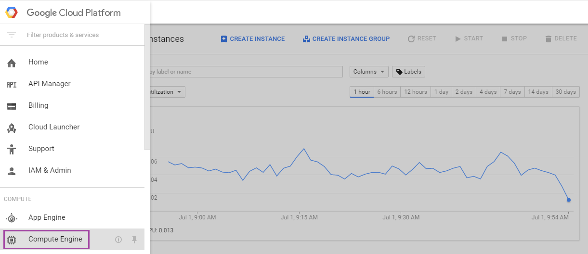
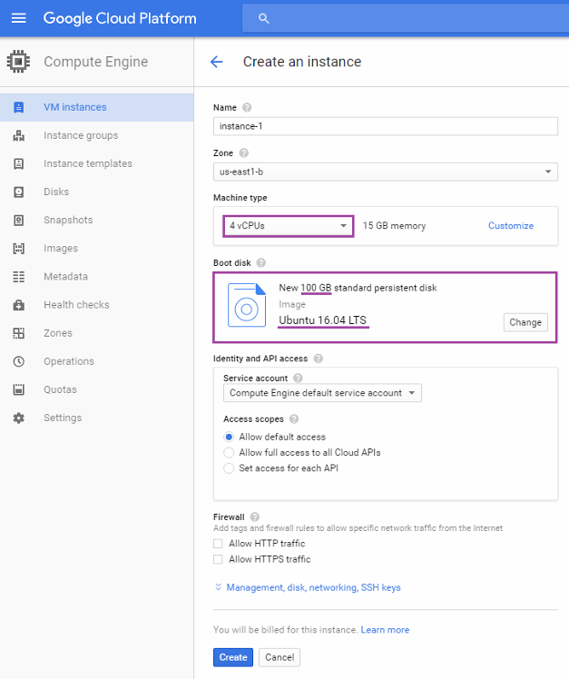
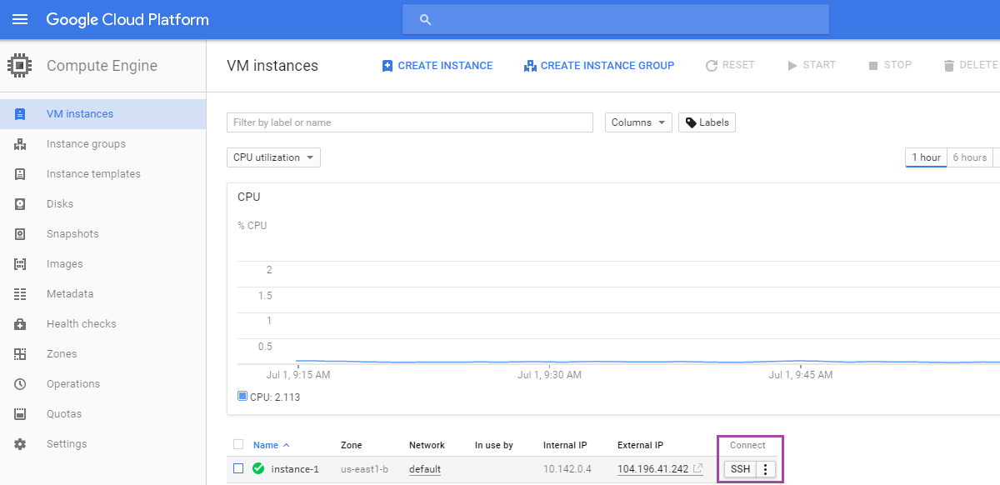

# kubesnap

## How to run
1. [Prerequisites](#1-prerequisites)  
2. [Start work with Google Cloud Platform](#2-start-work-with-google-cloud-platform)  
3. [Install kubesnap](#3-install-kubesnap)
4. [Contributing](#4-contributing)  
5. [License](#5-license)  
6. [Acknowledgements](#6-acknowledgements)  

### 1. Prerequisites

- **Kubernetes** cluster - tested with Kubernetes on Google Cloud Environment (GCE)

### 2. Start work with Google Cloud Platform

#### a) Open Google Cloud Platform Console
 - go to https://console.cloud.google.com/  
 - log in using your e-mail address
 - follow the instruction [how to create a Cloud Platform Console project](https://cloud.google.com/storage/docs/quickstart-console)


#### b) Select your project  
- select your project from the drop-down menu in the top right corner
    

#### c) Switch to _**Compute Engine**_ screen

- select _Products & Services_ from GC Menu in the top left corner  

   

- and then select _Compute Engine_ from the drop-down list

  

#### d) Create a new VM instance  
- create a new VM instance
    

- set the instance name
- choose a machine with at least 4 vCPUs and at least 15GB RAM
- select Ubuntu 16.04 with standard persistent disk with at least 100GB

    

#### e) Open the VM terminal by click on SSH  
 -  click on SSH to open the VM terminal (it will open as a new window)

   

#### f) Authorize access to Google Cloud Platform  
- manage credentials for the Google Cloud SD. To do that, run the following command:
  ```
  gcloud auth login
  ```
  Answer `Y` to the question (see below) and follow the instructions:
  -	copy the link in your browser and 
  -	authenticate with a service account which you use in Google Cloud Environment,
  - copy the verification code from browser window and enter it

  

- check if you are on credentialed accounts:  
 ```
 gcloud auth list
 ```


### 3. Install kubesnap  
Clone kubesnap into your home directory:
```
git clone https://github.com/intelsdi-x/kubesnap
```
kubesnap supports automatic installation via script [provision-kubesnap.sh](https://github.com/intelsdi-x/kubesnap/blob/master/tools/provision-kubesnap.sh)

Go to kubesnap/tools:
```
cd kubesnap/tools
```

##### Building and starting kubesnap

- Provision kubesnap:
```
./provision-kubesnap.sh
```

### 4. Contributing
We love contributions!

There's more than one way to give back, from examples to blogs to code updates. See our recommended process in [CONTRIBUTING.md](CONTRIBUTING.md).

And **thank you!** Your contribution, through code and participation, is incredibly important to us.

### 5. License
[snap](http://github.com:intelsdi-x/snap), along with this kubesnap, is an Open Source software released under the Apache 2.0 [License](LICENSE).

### 6. Acknowledgements
* Authors: [Izabella Raulin](https://github.com/IzabellaRaulin),  [Marcin Olszewski](https://github.com/marcintao),  [Marcin Krolik](https://github.com/marcin-krolik), [Andrzej Kuriata](https://github.com/andrzej-k/)
